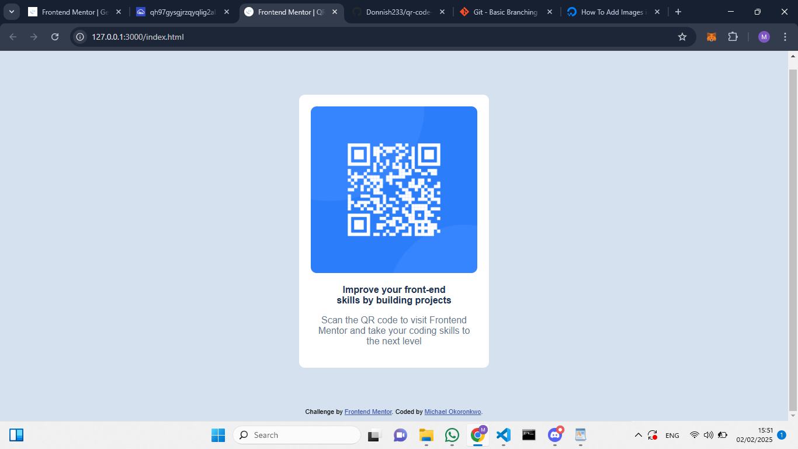

# Frontend Mentor - QR code component solution

This is a solution to the [QR code component challenge on Frontend Mentor](https://www.frontendmentor.io/challenges/qr-code-component-iux_sIO_H). Frontend Mentor challenges help you improve your coding skills by building realistic projects. 

## Table of contents

- [Overview](#overview)
  - [Screenshot](#screenshot)
  - [Links](#links)
- [My process](#my-process)
  - [Built with](#built-with)
  - [What I learned](#what-i-learned)
  - [Continued development](#continued-development)
  - [Useful resources](#useful-resources)
- [Author](#author)
- [Acknowledgments](#acknowledgments)

**Note: Delete this note and update the table of contents based on what sections you keep.**

## Overview

### Screenshot



### Links

- Solution URL: [Add solution URL here](https://github.com/Donnish233/qr-code-component.git)
- Live Site URL: [Add live site URL here](https://donnish233.github.io/qr-code-component/)

## My process

### Built with

- Semantic HTML5 markup
- CSS custom properties
- Flexbox

### What I learned

I learnt how to insert an icon to the tab heading of a page. Details below:
```html
<link rel="icon" type="image/png" sizes="32x32" href="./images/favicon-32x32.png">
```
Also learnt how to add a font-type that may not necessarily be in your local device to your css file. Details below:
```css
@font-face {
    font-family: 'Outfit';
    src: url(https://fonts.google.com/specimen/Outfit);
}
```

### Continued development

- Getting better in CSS positing and Grid frameworks
- Semantic HTML

## Author

- Frontend Mentor - [@Donnish233](https://www.frontendmentor.io/profile/Donnish233)
- Twitter - [@ToxicDonni](https://www.twitter.com/ToxicDonni)


